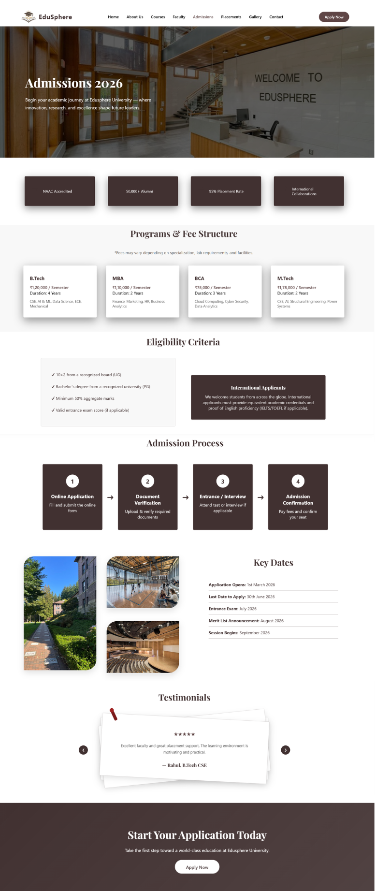
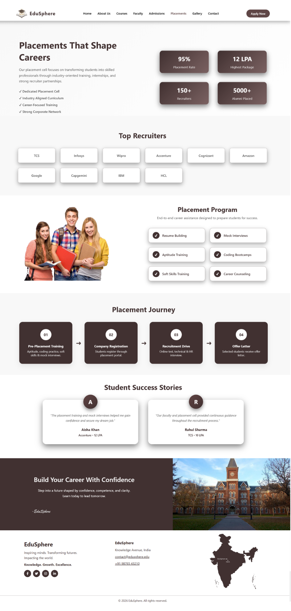
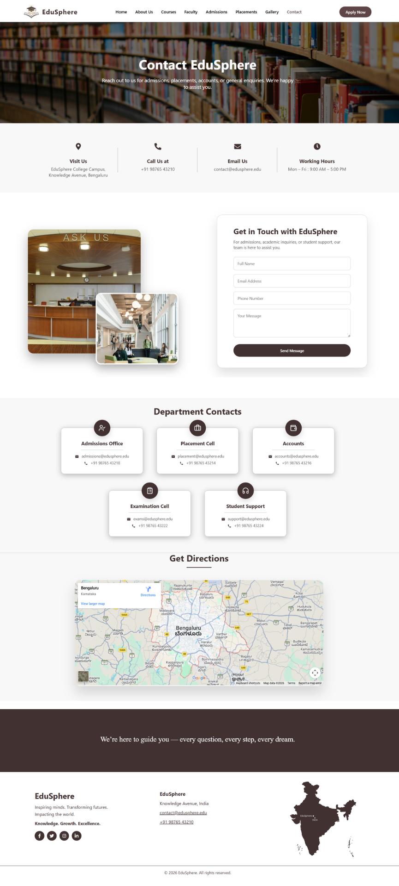

# 🎓 EduSphere – College Website
EduSphere is a modern, fully responsive educational institution website developed using React and Vite.
It delivers a seamless multi-page experience with dynamic course filtering, smooth scroll animations, and structured component-based architecture.
The project emphasizes clean UI design, performance optimization, and scalable front-end development practices.


## ✨ Features

- Multi-page routing using React Router for seamless navigation
- Smooth scroll animations for engaging user experience
- Dynamic course filtering by category (Technology, Management, Arts, Science)
- "Apply Now" buttons redirect to Contact page for easy admissions
- Fully responsive design across desktop, tablet, and mobile
- Reusable Navbar and Footer components for consistent layout
- Clean, modular, and scalable folder structure
- Deployed on Vercel with live demo link


## 🛠 Tech Stack

---

- **React**
- **Vite**
- **React Router DOM**
- **React Icons**
- **CSS3**
- **Vercel (Deployment)**

---

## 📂 Project Structure
---

edusphere
│
├── public/images
├── src
│   ├── components
│   │   ├── Navbar.jsx
│   │   ├── Footer.jsx
│   │   └── ScrollToTop.jsx
│   │
│   ├── hooks
│   │   └── useScrollAnimation.js
│   │
│   ├── pages
│   │   ├── Home.jsx
│   │   ├── About.jsx
│   │   ├── Admissions.jsx
│   │   ├── Courses.jsx
│   │   ├── Faculty.jsx
│   │   ├── Placements.jsx
│   │   ├── Gallery.jsx
│   │   └── Contact.jsx
│   │
│   ├── styles
│   │   ├── Home.css
│   │   ├── About.css
│   │   ├── Courses.css
│   │   ├── Contact.css
│   │   ├── Faculty.css
│   │   ├── Placements.css
│   │   ├── Gallery.css
│   │   └── Contact.css
│   │
│   ├── App.jsx
│   ├── main.jsx
│   └── index.jsx
│
├── index.html
├── vercel.json
├── package.json
└── vite.config.js

---

## ⚙️ Installation & Setup

### Clone the repository:
```bash
git clone https://github.com/maazfatima21/EduSphere.git
```

### Navigate to project:
```bash
cd edusphere
```

### Install dependencies:
```bash
npm install
```

### Run development server:
```bash
npm run dev
```

### Build for production:
```bash
npm run build
```

### Preview build:
```bash
npm run preview
```

## 📸 Screenshots

### Home Page


### About Page


### Admission Page


### Gallery Page


### Placements Page


### Contact Page



### 🌐 Live Demo:
[link] : (https://edusphere-peach.vercel.app/)